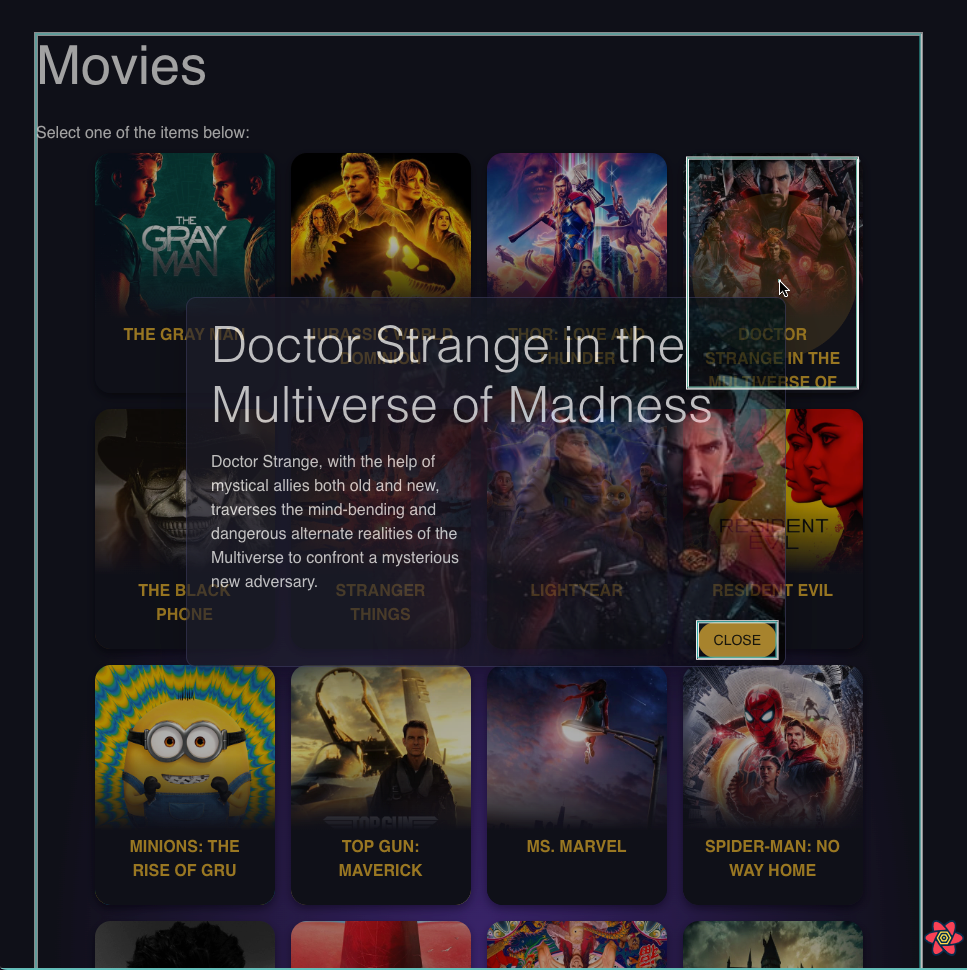

# React Exercise - SWC, Context and react-query

  
  
This is an exercise made to learn more about:

- bundling with **webpack** + **swc**
- experiment pagination approaches with react-query
- testing _use-context-selector_ library

**Information:**
All the data shown in the app is from [TMDB api](https://www.themoviedb.org/).

# Usage

- run `yarn` or `npm install` to install all the dependencies
- then run `yarn dev` or `npm run dev` to run the app in port `8080`

The terminal will open `localhost:8080` automatically for you.

# Technologies

- **React** bundled with
  - **Webpack** and
  - **SWC**(faster than Babel)
- **React Query** to fetch data from api
- Material UI to style the application
  - Use of Material UI CSS-in-JS solution

### Bundling configurations

- use `inline-source-map` devtool in _development_ environment to make it easier to debug;
- Root import using `~/` indicating `src` folder to prevent long lines hard to predict relative path indicators `../../../..`;
- No `*.css` files are supported because since I'm using _Material UI_ I decided to style using CSS-in-JS only. Not having the `css-loader/style-loader` set ensures I'm not going to mix approaches;
- Use of **Bundle Analyzer** to help understanding/reviewing decisions

### Other decisions

- use `humps` to ensure code standard for naming convention `camelCase`;
- use `use-context-selector` to help indicating react what has to be rerendered when context has changes; the image below highlights what is rerendered when context changes the `selected` movie. With normal ContextAPI it rerendered all the movie cards.

---

Thanks 👋🏻
